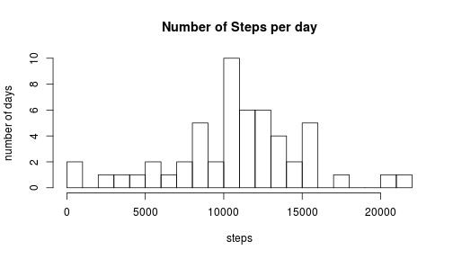
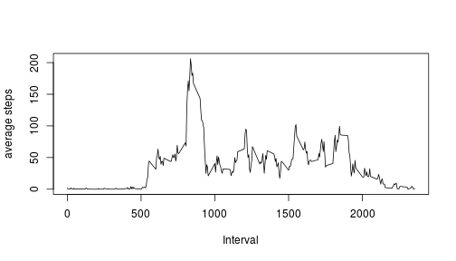
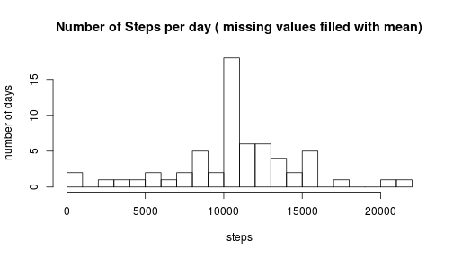
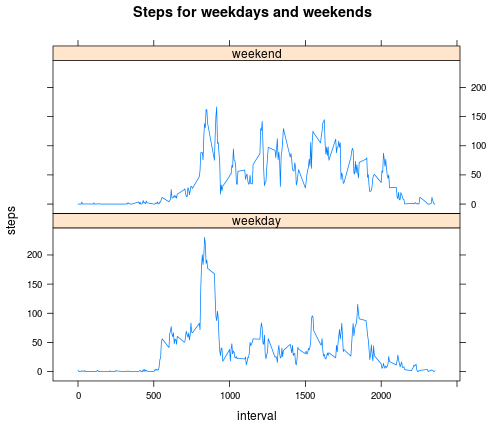

## Introduction

It is now possible to collect a large amount of data about personal
movement using activity monitoring devices such as a
[Fitbit](http://www.fitbit.com), [Nike
Fuelband](http://www.nike.com/us/en_us/c/nikeplus-fuelband), or
[Jawbone Up](https://jawbone.com/up). These type of devices are part of
the "quantified self" movement -- a group of enthusiasts who take
measurements about themselves regularly to improve their health, to
find patterns in their behavior, or because they are tech geeks. But
these data remain under-utilized both because the raw data are hard to
obtain and there is a lack of statistical methods and software for
processing and interpreting the data.

This assignment makes use of data from a personal activity monitoring
device. This device collects data at 5 minute intervals through out the
day. The data consists of two months of data from an anonymous
individual collected during the months of October and November, 2012
and include the number of steps taken in 5 minute intervals each day.


## Data

The data for this assignment can be downloaded from the course web
site:

* Dataset: [Activity monitoring data](https://d396qusza40orc.cloudfront.net/repdata%2Fdata%2Factivity.zip) [52K]

The variables included in this dataset are:

* **steps**: Number of steps taking in a 5-minute interval (missing
    values are coded as `NA`)

* **date**: The date on which the measurement was taken in YYYY-MM-DD
    format

* **interval**: Identifier for the 5-minute interval in which
    measurement was taken

The dataset is stored in a comma-separated-value (CSV) file and there
are a total of 17,568 observations in this
dataset.

## Data Analysis

### Loading and preprocessing the data

```r
data = read.csv("activity.csv")
str(data)
```

```
## 'data.frame':	17568 obs. of  3 variables:
##  $ steps   : int  NA NA NA NA NA NA NA NA NA NA ...
##  $ date    : Factor w/ 61 levels "2012-10-01","2012-10-02",..: 1 1 1 1 1 1 1 1 1 1 ...
##  $ interval: int  0 5 10 15 20 25 30 35 40 45 ...
```

### What is mean total number of steps taken per day?

* the total number of steps taken per day

```r
stepDay = aggregate(data$steps, list(data$date), sum)
colnames(stepDay) = c("date", "step")
stepDay$date = as.Date(stepDay$date)
str(stepDay)
```

```
## 'data.frame':	61 obs. of  2 variables:
##  $ date: Date, format: "2012-10-01" "2012-10-02" ...
##  $ step: int  NA 126 11352 12116 13294 15420 11015 NA 12811 9900 ...
```

* A histogram of the steps per day:

```r
hist(stepDay$step, 20, main="Number of Steps per day", xlab="steps", ylab="number of days")
```

 


* the mean and median of the total number of steps taken per day:

```r
meanStep = mean(stepDay$step, na.rm=T)
medStep = median(stepDay$step, na.rm=T)
```
Based on the calculation above, the mean steps per day is 10766.19, and the median steps per day is 10765.


### What is the average daily activity pattern?

* Get the 5-minute interval steps data

```r
step5m = aggregate(steps ~ interval, data=data, FUN=mean)
str(step5m)
```

```
## 'data.frame':	288 obs. of  2 variables:
##  $ interval: int  0 5 10 15 20 25 30 35 40 45 ...
##  $ steps   : num  1.717 0.3396 0.1321 0.1509 0.0755 ...
```

* Make a time series plot

```r
plot(step5m, xlab="Interval", ylab="average steps", type='l')
```

 

The maximum number of steps on average is the interval of 835, and the time is 13:55 of the day.

### Imputing missing values

* The total number of missing values

```r
numNAs = sum(is.na(data$steps))
```
Thus, the total number of missing values is 2304 which is 13.11% of all the data.

* We can fill the missing values with the mean of corresponding interval, and save it to a new data frame:

```r
data2 = merge(data, step5m, by="interval", all.x=TRUE)
colnames(data2) = c("interval", "steps", "date", "aveStep")
NAcols = is.na(data2$steps)
data2$steps[NAcols] = as.integer(data2$aveStep[NAcols])
data2 = data2[, 1:3]
data2 = data2[order(data2$date, data2$interval), ]
data2 = data2[, names(data)]
data2$date = as.Date(data2$date)
head(data2)
```

```
##     steps       date interval
## 1       1 2012-10-01        0
## 63      0 2012-10-01        5
## 128     0 2012-10-01       10
## 205     0 2012-10-01       15
## 264     0 2012-10-01       20
## 327     2 2012-10-01       25
```

Using the new data set with missing values filled in:

* the total number of steps taken per day

```r
stepDay = aggregate(data2$steps, list(data2$date), sum)
colnames(stepDay) = c("date", "step")
stepDay$date = as.Date(stepDay$date)
str(stepDay)
```

```
## 'data.frame':	61 obs. of  2 variables:
##  $ date: Date, format: "2012-10-01" "2012-10-02" ...
##  $ step: int  10641 126 11352 12116 13294 15420 11015 10641 12811 9900 ...
```

* A histogram of the steps per day:

```r
hist(stepDay$step, 20, main="Number of Steps per day ( missing values filled with mean)", xlab="steps", ylab="number of days")
```

 


* the mean and median of the total number of steps taken per day:

```r
meanStep = mean(stepDay$step, na.rm=T)
medStep = median(stepDay$step, na.rm=T)
```
Based on the calculation above, the mean steps per day is 10749.77, and the median steps per day is 10641.
Generally, the new values are lower than the data set with missing values. This may be because of the filled values are the average steps of intervals, and there are more available values for the mean and median.

### Are there differences in activity patterns between weekdays and weekends?

* Create a new factor variable in the dataset with two levels -- "weekday" and "weekend" indicating whether a given date is a weekday or weekend day.

```r
days = weekdays(data2$date)
wkd <- function(x) {
  if (x %in% c("Saturday", "Sunday")){ return("weekend") }
  else{ return("weekday")}
}
days = as.vector(sapply(days, wkd))
data2$wkd = as.factor(days)
head(data2)
```

```
##     steps       date interval     wkd
## 1       1 2012-10-01        0 weekday
## 63      0 2012-10-01        5 weekday
## 128     0 2012-10-01       10 weekday
## 205     0 2012-10-01       15 weekday
## 264     0 2012-10-01       20 weekday
## 327     2 2012-10-01       25 weekday
```


```r
data3 = aggregate(steps ~ wkd + interval, data=data2, FUN=mean)
library(lattice)
xyplot(steps~interval | wkd, data=data3,
       main="Steps for weekdays and weekends", xlab="interval",  ylab="steps",layout=c(1,2),type=c("l","l"))
```

 
